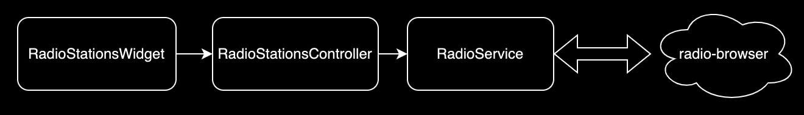

# flutter_radio

### [English](README.md), [中文](README.zh-tw.md)

This flutter radio project demonstrates the use of [radio-browser](https://www.radio-browser.info/) API, retrofit, and riverpod. Retrofit is a HTTP client library, and riverpod is a reactive caching and data-binding framework to take care of application's logic. Additionally, we use [audioplayers](https://pub.dev/packages/audioplayers) to play radio station and realm database to store favorite and played radio stations.

## Dependencies
   - [retrofit](https://pub.dev/packages/retrofit): A HTTP client library
   - [riverpod](https://pub.dev/packages/riverpod): A reactive caching and data-binding framework
   - [freezed](https://pub.dev/packages/freezed): Code generator for data classe
   - [audioplayers](https://pub.dev/packages/audioplayers): A Flutter plugin to play multiple simultaneously audio files
   - [realm](https://pub.dev/packages/realm): Realm is a mobile database that runs directly inside phones, tablets or wearables
   - [go_router](https://pub.dev/packages/go_router): A declarative routing package for Flutter
   - [shared_preferences](https://pub.dev/packages/shared_preferences): Wraps platform-specific persistent storage for simple data
   - [search_choices](https://pub.dev/packages/search_choices): Highly customizable Widget to search through a single or multiple choices list in a dialog box or a menu

## How to Run
  1. git clone https://github.com/ethanlyko/flutter_radio.git
  2. Run it

## Overview
This project utilizes riverpod to handle state transitions. When radio stations query executes, ui widgets watch query result which is handled by riverpod mechanism.

Moreover, played radio stations and favorite stations are stored as realm database records. These records can be displayed in favorate and history widgets which utilize riverpod mechanism.